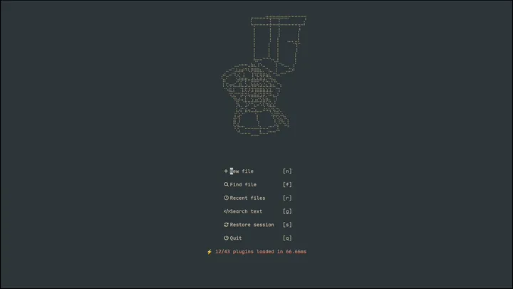

# wrfm.nvim

Braille wireframe viewer for Neovim — render [`.wrfm`](https://github.com/Vaishnav-Sabari-Girish/wireforge/tree/main/crates/wrfm) 3D models as Unicode braille art.



We provide:

- Zero-dependency braille wireframe renderer
- Floating window and inline preview modes
- Live hot-reload and auto-spin animation

For **creating** and **editing** `.wrfm` models — the flip side of viewing
— see [wrfm-skill](https://github.com/lenitain/wrfm-skill), an agent skill
that teaches coding agents to build, fix, and review wireframes image-first.

## Requirements

- **Neovim** >= 0.11 (uses modern APIs)
- **Terminal** with Unicode braille support — virtually all modern terminals
  (iTerm2, Alacritty, Kitty, WezTerm, Ghostty, foot, Windows Terminal,
  GNOME Terminal, Konsole, ...). Braille is plain Unicode text, so it renders
  over ssh, tmux, and tty — no image protocols, no passthrough, no special
  configuration.

## Installation

**lazy.nvim**

```lua
{
  "lenitain/wrfm.nvim",
  opts = {},
}
```

<details>
<summary>Other package managers</summary>

**pckr.nvim**

```lua
use { "lenitain/wrfm.nvim", config = function() require("wrfm").setup({}) end }
```

**mini.deps**

```lua
add({ source = "lenitain/wrfm.nvim" })
later(function() require("wrfm").setup({}) end)
```

**Manual**: copy `lua/`, `plugin/`, `doc/`, and `ftdetect/` to your Neovim
runtimepath, then run `:helptags ALL`.

</details>

`setup()` is optional; every option has a default.

## Configuration

### Default configuration

```lua
require("wrfm").setup({
  -- Canvas size (braille character cells)
  -- nil = auto-calculate from window dimensions
  default_width = nil,
  default_height = nil,

  -- Size caps
  max_width = nil,            -- hard cap in columns (nil = unlimited)
  max_height = nil,           -- hard cap in rows (nil = unlimited)
  max_width_window_percentage = 80,   -- % cap relative to host window
  max_height_window_percentage = 60,  -- % cap relative to host window

  -- Camera
  default_pitch = 30,         -- initial pitch in degrees (0 = front, 90 = top)
  default_distance = nil,     -- camera distance (nil = auto-fit model)

  -- Animation
  default_auto_spin = true,   -- start spinning after render()
  default_spin_speed = 0.02,  -- radians per frame
  fps = 30,                   -- animation frame rate
  pause_spin_when_unfocused = true,   -- pause repaints when host window unfocused

  -- Hot reload
  default_watch = true,       -- auto-update when .wrfm file changes

  -- Appearance
  highlight = "Yellow",       -- wireframe color: hex "#RRGGBB" or a theme
                              -- highlight group to link (e.g. "Function")

  -- Inline preview
  integrations = {
    wrfm = {
      enabled = true,                     -- auto-attach for *.wrfm buffers
      clear_in_insert_mode = false,       -- hide during insert mode
      only_render_at_cursor = false,      -- show only near cursor
      cursor_mode = "popup",              -- "popup" (float) or "inline" (extmark)
      filetypes = { "wrfm" },
    },
  },
})
```

Unknown keys raise an error, so typos surface immediately. The percentage
and absolute caps clamp derived _and_ explicit sizes; per-model overrides
(`max_width_window_percentage`, ...) and `ignore_max_size` are available on
`from_file()`.

## How to ...?

<details>
<summary>Change the wireframe color</summary>

Set `highlight` in `setup()` to either a hex color or a theme group:

```lua
require("wrfm").setup({ highlight = "#ff8800" })   -- fixed orange
require("wrfm").setup({ highlight = "Function" })  -- follow the colorscheme
```

- A hex value (`#RRGGBB`) paints the art in exactly that color and always
  wins, even across colorscheme switches.
- A group name links the wireframes to that theme group, so the color follows
  your colorscheme and updates when you switch themes. Like the default
  (`"Yellow"`), an unset link is a fallback: a colorscheme that defines
  `WrfmPreview` itself still takes precedence.
- Malformed values (e.g. `"#12"`) raise on `setup()`, like unknown keys.

Every live view recolors instantly — highlight groups resolve by name at draw
time, so no re-render is needed. To change the color at runtime:

```lua
require("wrfm").set_highlight("#00ff88")
```

</details>

<details>
<summary>Enable / disable / get plugin status</summary>

you can enable/disable the plugin and check its status on demand.

```lua
require("wrfm").enable()   -- re-render everything registered
require("wrfm").disable()  -- hide views; registry intact; render() becomes no-op
print(require("wrfm").is_enabled()) -- bool
```

While disabled, `from_file()` still works (construction is legal); only
drawing is suppressed, and `enable()` rebuilds every registered view.

</details>

<details>
<summary>Load a model with options</summary>

`from_file()` registers a model and assigns an id (`"model-N"` unless
`options.id` is given); a live `options.id` is reused, so repeating the call
returns the same model.

```lua
local model = require("wrfm").from_file("anvil.wrfm", {
  window = winid,          -- anchor the float to a specific window
  buffer = bufnr,          -- draw into this buffer instead of a float
  width = 40, height = 20, -- canvas size
  x = 0, y = 0,            -- offset from the centered float placement
  distance = nil,          -- pin camera distance (nil = auto-fit)
  pitch = 30, yaw = 0,     -- degrees
  auto_spin = true,
  spin_speed = 0.02,
  watch = true,            -- hot-reload this file
  border = true,           -- false = frameless seamless overlay (image.nvim look)
  virt_lines_above = true, -- inline preview anchor placement
  namespace = "panel",     -- registry tag for get_models() filtering
  id = "anvil-preview",    -- stable registry identity
})
```

</details>

<details>
<summary>Attach inline preview to a buffer</summary>

```lua
local model = require("wrfm").attach(bufnr, { path = "model.wrfm" })
require("wrfm").detach(bufnr)
```

`:WrfmHere` / `:WrfmDetach` do the same from the command line.

</details>

<details>
<summary>Control spinning animation</summary>

```lua
local model = require("wrfm").current

model:set_spin(false)      -- stop spinning
model:set_spin(true)       -- resume spinning
model:set_spin()           -- toggle current state

model:set_pitch(0)         -- front view
model:set_pitch(90)        -- top-down view
model:set_pitch(30)        -- default angle
```

</details>

<details>
<summary>Adjust camera distance</summary>

```lua
local model = require("wrfm").current

model:set_distance(2)      -- closer (smaller value = closer)
model:set_distance(10)     -- farther away
model:set_distance(nil)    -- auto-fit to model size
```

</details>

<details>
<summary>Reposition and resize the viewer</summary>

```lua
local model = require("wrfm").current

-- Resize canvas (persists across renders)
model:render({ width = 60, height = 30 })

-- Shift float relative to center
model:render({ x = -4, y = 2 })

-- Move to absolute editor coordinates
model:move(10, 5)
```

</details>

<details>
<summary>Use as a dashboard logo</summary>

A spinning wireframe makes a live start-screen logo:

```lua
-- pattern per plugin: "dashboard" (dashboard-nvim),
-- "alpha" (alpha-nvim), "snacks_dashboard" (snacks.nvim)
vim.api.nvim_create_autocmd({ "BufNewFile", "BufReadPost" }, {
  pattern = "dashboard",
  once = true,
  callback = function(args)
    local wrfm = require("wrfm")
    local model = wrfm.from_file(vim.fn.stdpath("config") .. "/logo.wrfm", {
      id = "dashboard-logo",
      width = 44,
      height = 13,
      spin_speed = 0.015,
    })
    model:render()
    model:move(math.floor((vim.o.columns - 44) / 2), 3)
    vim.api.nvim_create_autocmd("BufUnload", {
      buffer = args.buf,
      once = true,
      callback = function() wrfm.clear("dashboard-logo") end,
    })
  end,
})
```

</details>

<details>
<summary>Work with multiple models</summary>

```lua
local wrfm = require("wrfm")

-- Load multiple models
local anvil = wrfm.from_file("anvil.wrfm", { id = "anvil", namespace = "preview" })
local cube = wrfm.from_file("cube.wrfm", { id = "cube", namespace = "preview" })

-- List all live models (filters combine conjunctively)
local all = wrfm.get_models()
local previews = wrfm.get_models({ namespace = "preview" })
local per_buffer = wrfm.get_models({ buffer = bufnr })
local per_window = wrfm.get_models({ window = winid })

-- Destroy a model (instance method or registry id)
anvil:clear()
wrfm.clear("cube")

-- Destroy all
wrfm.clear()
```

</details>

<details>
<summary>Hide and show models without destroying them</summary>

```lua
local wrfm = require("wrfm")

wrfm.hide()              -- hide every view
wrfm.hide("anvil")       -- hide one
wrfm.show("anvil")       -- restore one
wrfm.show()              -- restore all
```

Camera, spin, and watch state survive the round trip.

</details>

## Commands

| Command           | Effect                                                                                                                                                                                                                   |
| ----------------- | ------------------------------------------------------------------------------------------------------------------------------------------------------------------------------------------------------------------------ |
| `:Wrfm [file]`    | View a [`.wrfm`](https://github.com/Vaishnav-Sabari-Girish/wireforge/tree/main/crates/wrfm) file (defaults to the current buffer's file) in a floating window; repeating it re-renders the existing viewer for that file |
| `:WrfmClear [id]` | Close viewers: with `id`, exactly that one (every match); without, all of them                                                                                                                                           |
| `:WrfmList`       | List live viewers: id, mode, spin state, source path                                                                                                                                                                     |
| `:WrfmHere`       | Attach inline preview to the current buffer (idempotent per buffer)                                                                                                                                                      |
| `:WrfmDetach`     | Detach inline preview from the current buffer                                                                                                                                                                            |
| `:WrfmReport`     | Floating diagnostic report: system info + live snapshot of every model                                                                                                                                                   |

`:WrfmList` shows ids for targeted `:WrfmClear <id>`.

`:WrfmReport` shows Neovim version and platform info, the active
configuration, a live snapshot of every registered model (id, mode,
namespace, canvas size, camera, spin/watch state), and resource counts
(timers, watchers). Run `:checkhealth wrfm` for a quick health check.

## Inline preview

The inline preview renders the wireframe as braille text inside the buffer
itself using extmark virtual lines — the text scrolls with the buffer.

When `only_render_at_cursor` is true, the preview appears near the cursor
line only. `cursor_mode = "popup"` shows a temporary floating window;
`"inline"` anchors the extmark to the cursor line — and in cursor-only mode
the preview follows the cursor as it moves, in both modes.

Pass `virt_lines_above = false` to render an inline preview below its anchor
line instead of above it.

## Hot reload

With `watch = true` (the default), each viewer follows its source file:
change and save the [`.wrfm`](https://github.com/Vaishnav-Sabari-Girish/wireforge/tree/main/crates/wrfm) in another editor and the
view updates, keeping your pitch/yaw/distance/spin state.

Inline previews also follow **unsaved edits**: an `on_lines` watcher re-parses
the buffer content as you type, so editing a [`.wrfm`](https://github.com/Vaishnav-Sabari-Girish/wireforge/tree/main/crates/wrfm) file previews live even
before `:write`. The disk and buffer channels dedup against the last parsed
text, so saving what is already shown does not repaint.

- Directory-level fs_event watching survives editors that replace files
  atomically by rename; filesystems without fs_event support fall back to a
  2 s poll automatically.
- A state that is momentarily unparseable (mid-edit, saved or unsaved) keeps
  its last good frame; a single warning is shown until it becomes valid again.
- Deleting the file keeps the last frame and stops the watcher.
- `watch = false` gives a static snapshot instead (both channels off).

## Lifecycle

Spin timers pause automatically when Neovim loses focus (`FocusLost`) or is
suspended (`VimSuspend`), and resume on `FocusGained` / `VimResume`. Views
stay visible — braille frames cost nothing to keep on screen. Manually
stopped spins are never resurrected by focus events.

By default (`pause_spin_when_unfocused = true`) a model whose host window is
not the focused window stops repainting: a dashboard logo hidden behind a
fullscreen terminal file-manager float, or a preview in a split you stopped
looking at, no longer burns a frame every tick. The timer keeps running, so
the spin resumes the moment you focus the host window again. Disable the
option to keep background models spinning unconditionally.

Bursts of relayout/reload events within one event-loop turn coalesce into a
single repaint.

Stale contexts are swept automatically: after `TabEnter`, `BufEnter` or
`WinClosed` every model whose window was closed, whose buffer was deleted, or
whose anchor window switched content is torn down — including non-spinning
models that no tick would ever inspect. Use `wrfm.hide()` when a view should
survive such transitions instead.

Rendering pauses while the command-line window is open (opening floats under
it would raise), and a programmatic first render issued before the UI exists
(e.g. from init.lua) is queued until `VimEnter` so terminal dimensions are
known before derived canvas sizes clamp against them.

Viewer floats are decorations: they open non-focusable, so your keys always
keep going to the focused window. Close them with `:WrfmClear`.

## FAQ

**Why braille instead of the Kitty/6el graphics protocols?**
Because braille output is plain text (see Requirements); the trade-off is
resolution, which is usually plenty for wireframes.

**Performance?**
Rendering is a few hundred microseconds per frame for typical models.

**What [.wrfm](https://github.com/Vaishnav-Sabari-Girish/wireforge/tree/main/crates/wrfm) files can I view?**
Any valid [`.wrfm`](https://github.com/Vaishnav-Sabari-Girish/wireforge/tree/main/crates/wrfm) file. The format supports vertices, edges, and
optional group sections. See the [wireforge](https://github.com/Vaishnav-Sabari-Girish/wireforge) project for format
details and model generators — or let the companion
[wrfm-skill](https://github.com/lenitain/wrfm-skill) generate one for you.

## Development

wrfm.nvim uses [mise](https://mise.jdx.dev/) for task running and tool version
pinning (`.tool-versions`).

```sh
curl https://mise.run | sh && mise install   # install mise + pinned tools
mise run test          # full test suite (busted via lazy.minit)
mise run format        # stylua-format lua/, plugin/, tests/
```

`mise run help` lists all tasks (test output variants, coverage,
golden-fixture regeneration, local CI via act). Tests are hermetic: golden
fixtures are committed, so the oracle comparison never needs the `wrfm` CLI at
runtime (`WRFM_SKIP_ORACLE=1` skips it anyway).

### Test layout

Each suite lives in a flat spec file next to shared fixtures and helpers:

```
tests/
├── *_spec.lua           # api / e2e / inline / oracle / parser / renderer suites
├── busted.lua           # entry point: nvim -l tests/busted.lua
├── helpers.lua
└── fixtures/            # golden files, .wrfm models
```

Interactive testing scenarios (Chinese): [docs/user-test-guide.md](./docs/user-test-guide.md)
